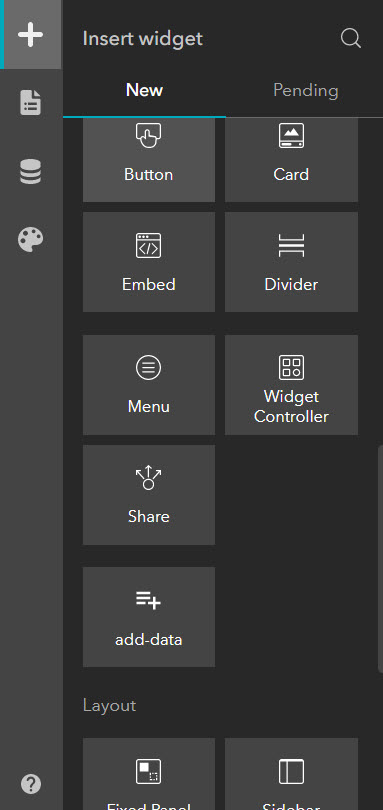

# Experience-Builder-Widgets
These widgets are available for deployment in next generation geospatial web apps, leveraging ArcGIS Experience Builder's powerful and versatile React-based framework to allow end users to perform a variety of mapping and visualization tasks.

---

## Requirements
* Create a client ID for your application and install Node.js and NPM by following the [ArcGIS Experience Builder Install Guide](https://developers.arcgis.com/experience-builder/guide/install-guide/)

---

## Deployment

1. Download Version 1.5 of [ArcGIS Experience Builder for Developers](https://developers.arcgis.com/downloads/#arcgis-experience-builder)
1. Extract the zip file into your desired location
1. Within the client folder, install all requirements
```sh
cd client
npm install
```
4. Clone the repo into the `client/innovate-widgets` folder
```sh
git clone git@github.com:Innovate-Inc/Experience-Builder-Widgets.git innovate-widgets
```
5. Add the widget(s) to your custom app through the Experience Builder Developer interface



---

## Widgets

### Add Data
The Add Data Widget adds functionality for users to search for, add, and remove data sources to maps.

#### Version
1.0

#### Latest Release
11/10/2021

#### Experience Builder Version
1.5